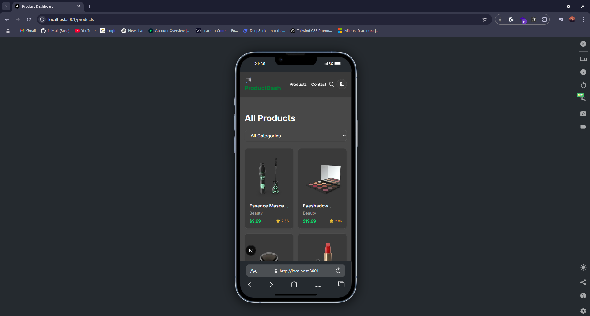
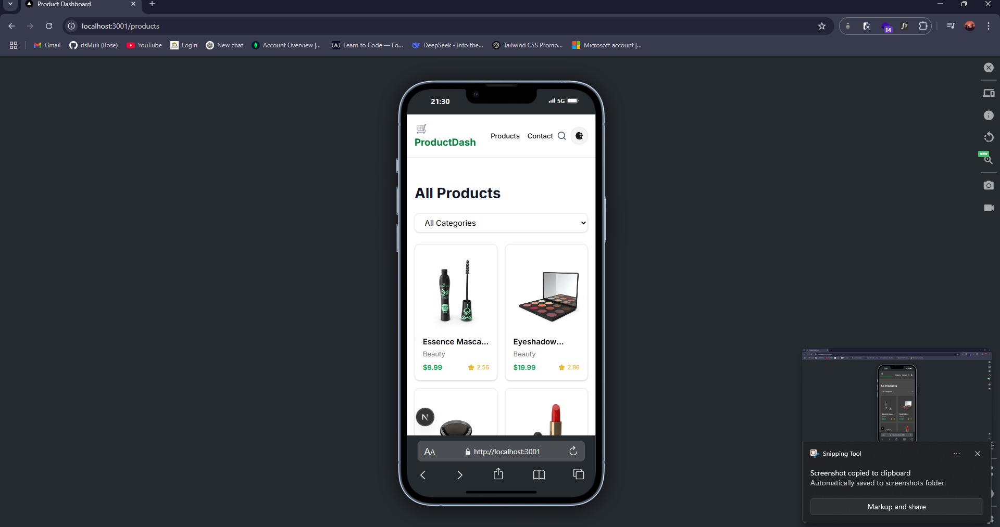
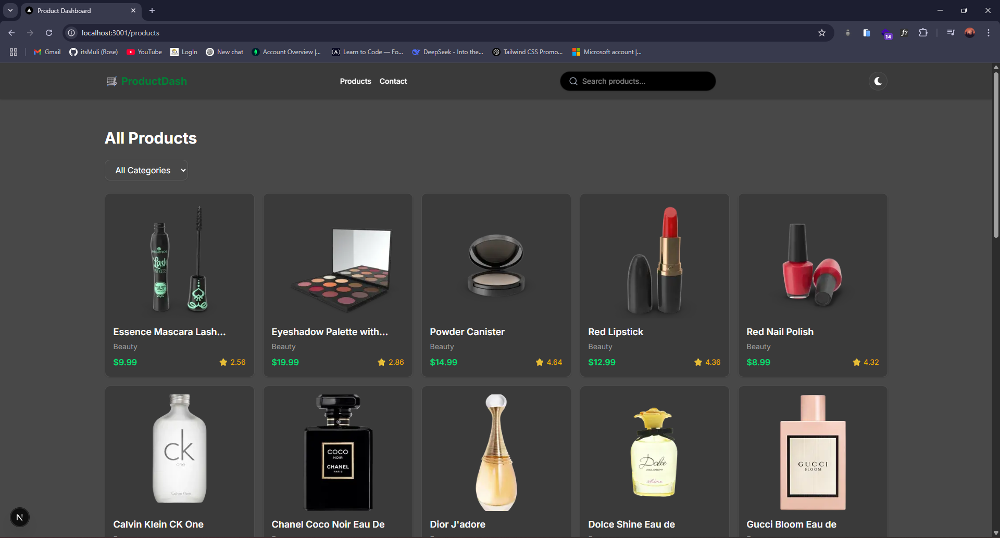

# Product Dashboard

A modern, responsive product dashboard built with Next.js 13+, Tailwind CSS, TypeScript, and React Query. This app allows users to explore products, view details, and toggle between light and dark modes.

light mode on desktop
dark mode on desktop
light mode on phone
dark mode on desktop

---

## Features

- Fast and responsive UI
- Light/Dark mode toggle (with `next-themes`)
- Global search functionality
- Category filtering (optional if implemented)
- Product detail pages with related product previews
- State management using React Query
- Utility-first styling via Tailwind CSS
- Clean component-based architecture (with reusable UI blocks)

---

## Tech Stack

- [Next.js 13+ (App Router)](https://nextjs.org/)
- [Tailwind CSS](https://tailwindcss.com/)
- [TypeScript](https://www.typescriptlang.org/)
- [React Query](https://tanstack.com/query/latest)
- [next-themes](https://github.com/pacocoursey/next-themes) for theme toggling
- [Framer Motion](https://www.framer.com/motion/) optional animations
- [Lucide Icons](https://lucide.dev/icons/) for icons
- [ShadCN UI](https://ui.shadcn.com/) for UI components

---

## Installation

```bash
# Clone the repo
git clone https://github.com/itsMuli/product-dashboard.git

cd product-dashboard

# Install dependencies
npm install

# Run the dev server
npm run dev
